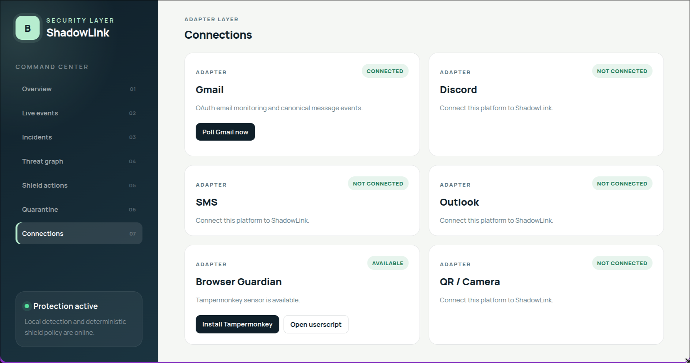
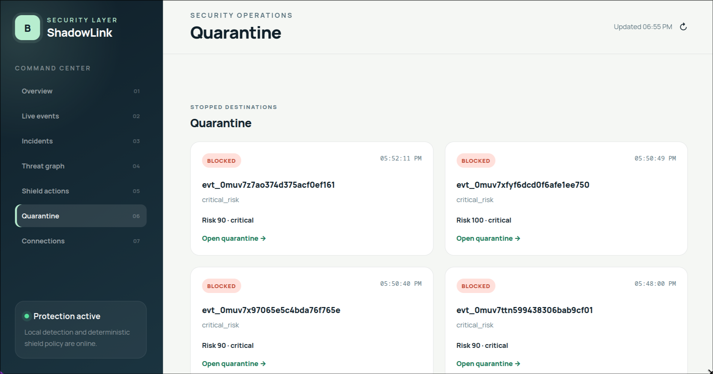
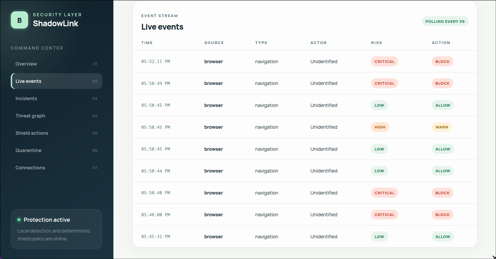
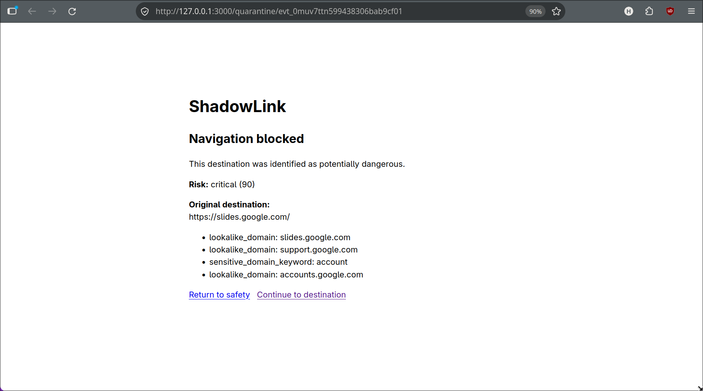

# ShadowLink - WIP
## Work In Progress

Our submission for Hack Sprint.

ShadowLink is a cross-platform cybersecurity system that detects and correlates threats across email, social media, QR codes, and web activity. It combines rule-based detection with configurable AI to identify malicious links, social-engineering attacks, and suspicious behavior. Its Browser Guardian protects users even on platforms without accessible APIs by monitoring and intercepting risky web navigation.

### Team Cipher
- Hridhuun Savant
- Kriti Sharma
- Priya Gupta
- Tanishka Sharma

## Previews

